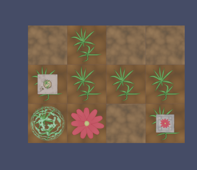

# Lee-Orr
They/Them - [Linked In](https://www.linkedin.com/in/lee-orr-orbach-403863119) - [Website](https://lee-orr.com)

Hello!
Welcome to my Github page.
I'm a software developer, actor, writer & composer - with a particular interest in entertainment, procedural generation & tool creation.

## My projects, Categorized
Here are some of my public projects & repositories, in case you'd like a look

### Game Jam Games
#### [Canal Mania](https://github.com/lee-orr/CanalMania)

This is a game I build for the Historically Accurate Game Jam, where you try to build canals at as low a cost as possible. If you want to play, you can try it here: https://lee-orr.itch.io/canal-mania

### [Terra and Caelus](https://github.com/lee-orr/terra-and-caelus)

Built for [Puzzle Jam 3](https://itch.io/jam/puzzle-jam-3), in this game you play as a spirit encouraging plants to grow. You can give it a shot here: https://lee-orr.itch.io/terra-and-caelus

### [The Just Two](https://github.com/lee-orr/the-just-two)

Built for [Random Jam](https://itch.io/jam/8bits-random-jam), in this game you give fate a hand in the fates of two warriors of justice on opposite sides of a war. Play with probabilities to nudge them towards success. You can find the game here: https://lee-orr.itch.io/the-just-two

Other game jam games can be found here: https://lee-orr.itch.io/

### Game Development Libraries
#### [Bevy Generative Grammars](https://github.com/lee-orr/bevy-generative-grammars)
This is a rust library for procedural generation using Grammars, with built in support for Tracery - as well as room to expand to other grammars. 

#### [Bevy Tilt Five](https://github.com/lee-orr/bevy-tilt-five)
This is an experimental bevy library for rendering to the tilt five. It is currently in a very early state.

### Development Related
#### [Spin Message Trigger](https://github.com/lee-orr/spin-message-trigger)
This is a plugin for [Fermyon Spin](https://github.com/fermyon/spin) - allowing it to use message brokers as triggers for wasm modules, and to publish the results from these modules to message brokers. At the moment, it supports an In-Memory broker, Redis, and NATS, as well as creating an HTTP gateway for publishing to the broker & WebSocket connection for subscribing to messages on specific subjects.

#### [Rusty Dev Containers](https://github.com/lee-orr/rusty-dev-containers)
This repo contains a collection of useful dev container features, to make it easier to them up for rust development.
